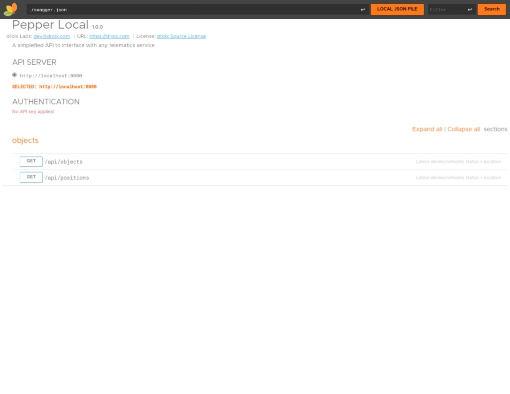

# Pepper Local

A simple telematics daemon/utility for storing local copy of position data while simplifying the API usages.



## Run development version

```shell
git clone https://github.com/drolx/pepper-local.git && \
cd pepper-local

# Create a virtual enviromental
# OR use make

make
make install

# For docker image
cp env.dev .env
make dup

# Run directly
make run
```

## Running in production

It's recommended to use only docker in production.

```shell
cp env.prod .env
docker compose up -d
```
